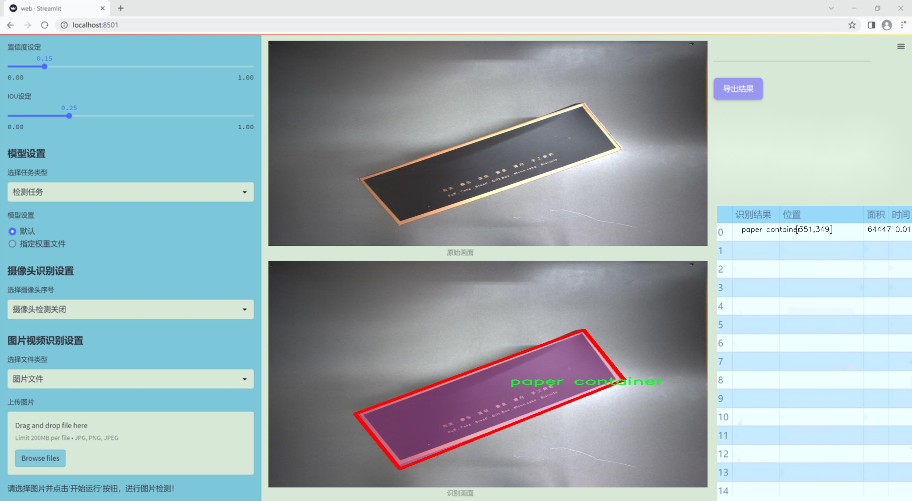
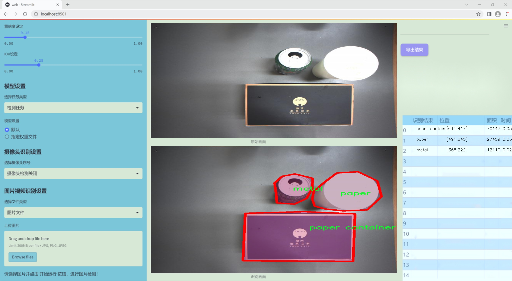
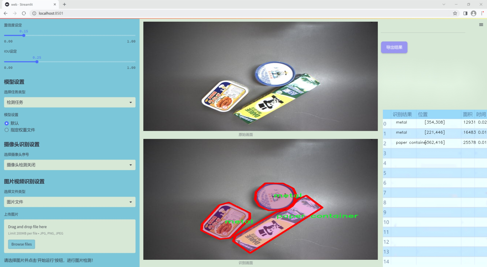
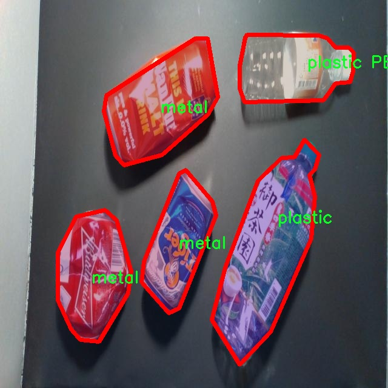
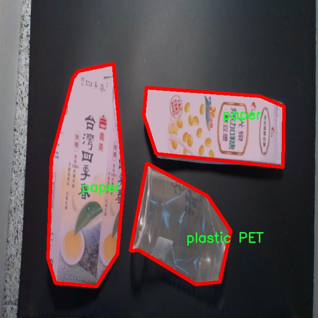
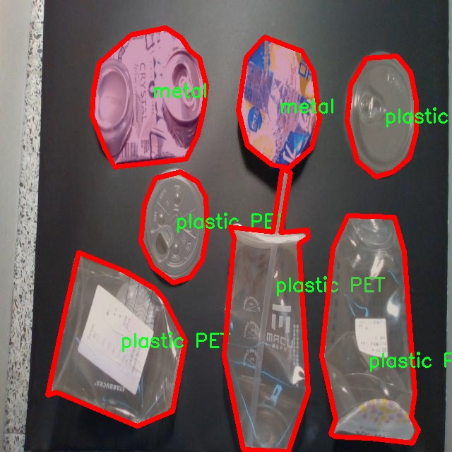
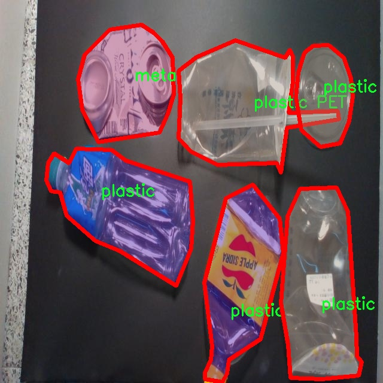
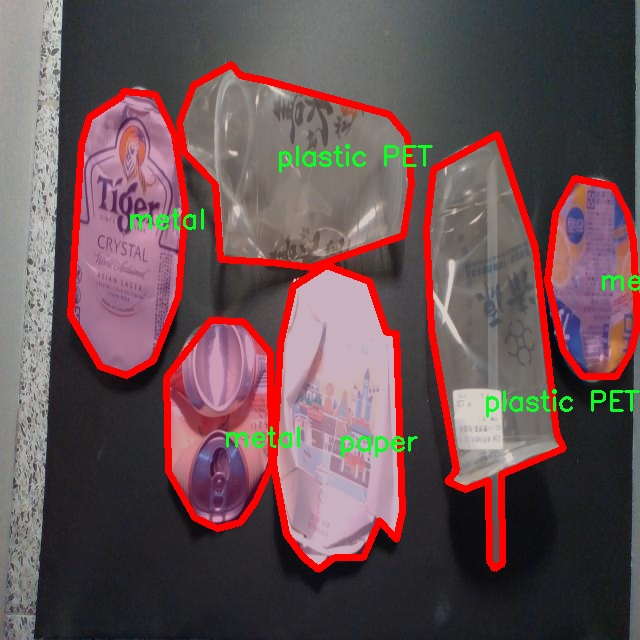

### 1.背景意义

研究背景与意义

随着城市化进程的加快，垃圾处理问题日益严重，环境污染和资源浪费现象愈发突出。垃圾分类作为一种有效的废物管理策略，不仅能够减少垃圾填埋和焚烧的数量，还能促进资源的回收和再利用，从而实现可持续发展目标。因此，开发高效的垃圾分类检测系统具有重要的现实意义。

近年来，深度学习技术在计算机视觉领域取得了显著进展，尤其是目标检测算法的快速发展，为垃圾分类提供了新的解决方案。YOLO（You Only Look Once）系列算法因其高效性和实时性，成为目标检测领域的热门选择。特别是YOLOv11的改进版本，结合了更先进的网络结构和优化策略，能够在复杂环境中实现更高的检测精度和速度。

本研究旨在基于改进的YOLOv11算法，构建一个高效的垃圾分类检测系统。为此，我们采用了TrashNet 2数据集，该数据集包含3300张经过精确标注的垃圾图像，涵盖金属、纸容器、纸张、塑料和塑料PET等五个类别。这些数据不仅为模型的训练提供了丰富的样本，还为后续的模型评估和优化奠定了基础。

通过对该数据集的深入分析和处理，我们希望能够提高模型在实际应用中的适应性和准确性。垃圾分类检测系统的成功实施，将为城市垃圾管理提供技术支持，推动公众参与垃圾分类，提高资源回收率，最终实现环境保护和资源可持续利用的目标。因此，本研究不仅具有学术价值，也具有重要的社会和经济意义。

### 2.视频效果

[2.1 视频效果](https://www.bilibili.com/video/BV1o1k9YFEXC/)

### 3.图片效果







##### [项目涉及的源码数据来源链接](https://kdocs.cn/l/cszuIiCKVNis)**

注意：本项目提供训练的数据集和训练教程,由于版本持续更新,暂不提供权重文件（best.pt）,请按照6.训练教程进行训练后实现上图演示的效果。

### 4.数据集信息

##### 4.1 本项目数据集类别数＆类别名

nc: 5
names: ['metal', 'paper container', 'paper', 'plastic PET', 'plastic']


该项目为【图像分割】数据集，请在【训练教程和Web端加载模型教程（第三步）】这一步的时候按照【图像分割】部分的教程来训练

##### 4.2 本项目数据集信息介绍

本项目数据集信息介绍

本项目所使用的数据集为“TrashNet 2”，旨在为改进YOLOv11的垃圾分类检测系统提供高质量的训练数据。该数据集专注于垃圾分类，涵盖了五个主要类别，分别为金属、纸容器、纸张、塑料PET和塑料。这些类别的选择不仅反映了现代城市垃圾处理的常见问题，也为智能垃圾分类系统的开发提供了基础数据支持。

“TrashNet 2”数据集的构建过程经过精心设计，确保每个类别的样本数量充足且多样化，以便于模型在训练过程中能够学习到不同类型垃圾的特征。数据集中包含的图像涵盖了各种环境和背景，模拟了实际生活中可能遇到的垃圾分类场景。这种多样性有助于提高模型的泛化能力，使其在面对不同的实际应用时能够表现出色。

此外，数据集中的图像均经过标注，确保每个类别的物体在图像中清晰可辨。通过使用“TrashNet 2”数据集，YOLOv11模型将能够有效地识别和分类这五种垃圾类型，从而提升智能垃圾分类系统的准确性和效率。随着城市化进程的加快，垃圾分类的重要性日益凸显，借助这一数据集的训练，期望能够推动垃圾分类技术的发展，为环境保护和资源回收做出贡献。

综上所述，“TrashNet 2”数据集不仅为本项目提供了必要的训练素材，也为未来的研究和应用奠定了坚实的基础。通过不断优化和改进YOLOv11模型，期望能够实现更高效的垃圾分类解决方案，为可持续发展目标的实现贡献力量。











### 5.全套项目环境部署视频教程（零基础手把手教学）

[5.1 所需软件PyCharm和Anaconda安装教程（第一步）](https://www.bilibili.com/video/BV1BoC1YCEKi/?spm_id_from=333.999.0.0&vd_source=bc9aec86d164b67a7004b996143742dc)


[5.2 安装Python虚拟环境创建和依赖库安装视频教程（第二步）](https://www.bilibili.com/video/BV1ZoC1YCEBw?spm_id_from=333.788.videopod.sections&vd_source=bc9aec86d164b67a7004b996143742dc)

### 6.改进YOLOv11训练教程和Web_UI前端加载模型教程（零基础手把手教学）

[6.1 改进YOLOv11训练教程和Web_UI前端加载模型教程（第三步）](https://www.bilibili.com/video/BV1BoC1YCEhR?spm_id_from=333.788.videopod.sections&vd_source=bc9aec86d164b67a7004b996143742dc)


按照上面的训练视频教程链接加载项目提供的数据集，运行train.py即可开始训练



     Epoch   gpu_mem       box       obj       cls    labels  img_size
     1/200     20.8G   0.01576   0.01955  0.007536        22      1280: 100%|██████████| 849/849 [14:42<00:00,  1.04s/it]
               Class     Images     Labels          P          R     mAP@.5 mAP@.5:.95: 100%|██████████| 213/213 [01:14<00:00,  2.87it/s]
                 all       3395      17314      0.994      0.957      0.0957      0.0843

     Epoch   gpu_mem       box       obj       cls    labels  img_size
     2/200     20.8G   0.01578   0.01923  0.007006        22      1280: 100%|██████████| 849/849 [14:44<00:00,  1.04s/it]
               Class     Images     Labels          P          R     mAP@.5 mAP@.5:.95: 100%|██████████| 213/213 [01:12<00:00,  2.95it/s]
                 all       3395      17314      0.996      0.956      0.0957      0.0845

     Epoch   gpu_mem       box       obj       cls    labels  img_size
     3/200     20.8G   0.01561    0.0191  0.006895        27      1280: 100%|██████████| 849/849 [10:56<00:00,  1.29it/s]
               Class     Images     Labels          P          R     mAP@.5 mAP@.5:.95: 100%|███████   | 187/213 [00:52<00:00,  4.04it/s]
                 all       3395      17314      0.996      0.957      0.0957      0.0845


###### [项目数据集下载链接](https://kdocs.cn/l/cszuIiCKVNis)

### 7.原始YOLOv11算法讲解


YOLO11 是 Ultralytics YOLO 系列的最新版本，结合了尖端的准确性、速度和效率，用于目标检测、分割、分类、定向边界框和姿态估计。与
YOLOv8 相比，它具有更少的参数和更好的结果，不难预见，YOLO11 在边缘设备上更高效、更快，将频繁出现在计算机视觉领域的最先进技术（SOTA）中。


**主要特点**

  * **增强的特征提取：**YOLO11 使用改进的主干和颈部架构来增强特征提取，以实现更精确的目标检测和复杂任务的性能。

  * **针对效率和速度优化：**精细的架构设计和优化的训练流程在保持准确性和性能之间最佳平衡的同时，提供更快的处理速度。

  * **更少的参数，更高的准确度：**YOLO11m 在 COCO 数据集上实现了比 YOLOv8m 更高的 mAP，参数减少了 22%，提高了计算效率，同时不牺牲准确度。

  * **跨环境的适应性：**YOLO11 可以无缝部署在边缘设备、云平台和配备 NVIDIA GPU 的系统上，确保最大的灵活性。

  * **支持广泛的任务范围：**YOLO11 支持各种计算机视觉任务，如目标检测、实例分割、图像分类、姿态估计和定向目标检测（OBB）。


### 8.200+种全套改进YOLOV11创新点原理讲解

#### 8.1 200+种全套改进YOLOV11创新点原理讲解大全

由于篇幅限制，每个创新点的具体原理讲解就不全部展开，具体见下列网址中的改进模块对应项目的技术原理博客网址【Blog】（创新点均为模块化搭建，原理适配YOLOv5~YOLOv11等各种版本）

[改进模块技术原理博客【Blog】网址链接](https://gitee.com/qunmasj/good)


#### 8.2 精选部分改进YOLOV11创新点原理讲解

###### 这里节选部分改进创新点展开原理讲解(完整的改进原理见上图和[改进模块技术原理博客链接](https://gitee.com/qunmasj/good)【如果此小节的图加载失败可以通过CSDN或者Github搜索该博客的标题访问原始博客，原始博客图片显示正常】


### HRNet V2简介
现在设计高低分辨率融合的思路主要有以下四种：


（a）对称结构。如U-Net、Hourglass等，都是先下采样再上采样，上下采样过程对称。

（b）级联金字塔。如refinenet等，高低分辨率融合时经过卷积处理。

（c）简单的baseline，用转职卷积进行上采样。

（d）扩张卷积。如deeplab等，增大感受野，减少下采样次数，可以无需跳层连接直接进行上采样。

（b）（c）都是使用复杂一些的网络进行下采样（如resnet、vgg），再用轻量级的网络进行上采样。

HRNet V1是在（b）的基础上进行改进，从头到尾保持大的分辨率表示。然而HRNet V1仅是用在姿态估计领域的，HRNet V2对它做小小的改进可以使其适用于更广的视觉任务。这一改进仅仅增加了较小的计算开销，但却提升了较大的准确度。

#### 网络结构图：


这个结构图简洁明了就不多介绍了，首先图2的输入是已经经过下采样四倍的feature map，横向的conv block指的是basicblock 或 bottleblock，不同分辨率之间的多交叉线部分是multi-resolution convolution（多分辨率组卷积）。

到此为止HRNet V2和HRNet V1是完全一致的。

区别之处在于这个基网络上加的一个head：


图3介绍的是接在图2最后的head。（a）是HRNet V1的头，很明显他只用了大分辨率的特征图。（b）（c）是HRNet V2的创新点，（b）用与语义分割，（c）用于目标检测。除此之外作者还在实验部分介绍了用于分类的head，如图4所示。


#### 多分辨率block：


一个多分辨率block由多分辨率组卷积（a）和多分辨率卷积（b）组成。（c）是一个正常卷积的展开，（b）的灵感来源于（c）。代码中（a）部分由Bottleneck和BasicBlock组成。

多分辨率卷积和正常卷积的区别：（1）多分辨率卷积中，每个通道的subset的分辨率都不一样。（2）通道之间的连接如果是降分辨率，则用的是3x3的2stride的卷积，如果是升分辨率，用的是双线性最邻近插值上采样。


### 9.系统功能展示

图9.1.系统支持检测结果表格显示

  图9.2.系统支持置信度和IOU阈值手动调节

  图9.3.系统支持自定义加载权重文件best.pt(需要你通过步骤5中训练获得)

  图9.4.系统支持摄像头实时识别

  图9.5.系统支持图片识别

  图9.6.系统支持视频识别

  图9.7.系统支持识别结果文件自动保存

  图9.8.系统支持Excel导出检测结果数据


### 10. YOLOv11核心改进源码讲解

#### 10.1 repvit.py

以下是对代码的逐文件分析和核心部分的保留，包含详细的中文注释：

```python
import torch.nn as nn
import numpy as np
from timm.models.layers import SqueezeExcite
import torch

# 定义可导出的模型名称
__all__ = ['repvit_m0_9', 'repvit_m1_0', 'repvit_m1_1', 'repvit_m1_5', 'repvit_m2_3']

def replace_batchnorm(net):
    """
    替换网络中的 BatchNorm2d 层为 Identity 层
    以便在推理时加速计算
    """
    for child_name, child in net.named_children():
        if hasattr(child, 'fuse_self'):
            fused = child.fuse_self()  # 融合卷积和批归一化层
            setattr(net, child_name, fused)
            replace_batchnorm(fused)
        elif isinstance(child, torch.nn.BatchNorm2d):
            setattr(net, child_name, torch.nn.Identity())  # 替换为 Identity
        else:
            replace_batchnorm(child)

def _make_divisible(v, divisor, min_value=None):
    """
    确保所有层的通道数是可被 divisor 整除的
    :param v: 输入的通道数
    :param divisor: 除数
    :param min_value: 最小值
    :return: 处理后的通道数
    """
    if min_value is None:
        min_value = divisor
    new_v = max(min_value, int(v + divisor / 2) // divisor * divisor)
    # 确保向下取整不会减少超过 10%
    if new_v < 0.9 * v:
        new_v += divisor
    return new_v

class Conv2d_BN(torch.nn.Sequential):
    """
    自定义的卷积 + 批归一化层组合
    """
    def __init__(self, a, b, ks=1, stride=1, pad=0, dilation=1,
                 groups=1, bn_weight_init=1):
        super().__init__()
        # 添加卷积层
        self.add_module('c', torch.nn.Conv2d(
            a, b, ks, stride, pad, dilation, groups, bias=False))
        # 添加批归一化层
        self.add_module('bn', torch.nn.BatchNorm2d(b))
        # 初始化批归一化的权重
        torch.nn.init.constant_(self.bn.weight, bn_weight_init)
        torch.nn.init.constant_(self.bn.bias, 0)

    @torch.no_grad()
    def fuse_self(self):
        """
        融合卷积层和批归一化层为单一卷积层
        """
        c, bn = self._modules.values()
        w = bn.weight / (bn.running_var + bn.eps)**0.5  # 计算新的权重
        w = c.weight * w[:, None, None, None]  # 进行权重调整
        b = bn.bias - bn.running_mean * bn.weight / (bn.running_var + bn.eps)**0.5  # 计算新的偏置
        m = torch.nn.Conv2d(w.size(1) * self.c.groups, w.size(0), w.shape[2:], 
                            stride=self.c.stride, padding=self.c.padding, 
                            dilation=self.c.dilation, groups=self.c.groups,
                            device=c.weight.device)
        m.weight.data.copy_(w)  # 复制权重
        m.bias.data.copy_(b)  # 复制偏置
        return m

class Residual(torch.nn.Module):
    """
    残差连接模块
    """
    def __init__(self, m, drop=0.):
        super().__init__()
        self.m = m  # 模块
        self.drop = drop  # 随机丢弃率

    def forward(self, x):
        if self.training and self.drop > 0:
            # 训练模式下，随机丢弃部分输出
            return x + self.m(x) * torch.rand(x.size(0), 1, 1, 1,
                                              device=x.device).ge_(self.drop).div(1 - self.drop).detach()
        else:
            return x + self.m(x)  # 直接加上残差

    @torch.no_grad()
    def fuse_self(self):
        """
        融合残差模块中的卷积层
        """
        if isinstance(self.m, Conv2d_BN):
            m = self.m.fuse_self()
            identity = torch.ones(m.weight.shape[0], m.weight.shape[1], 1, 1)
            identity = torch.nn.functional.pad(identity, [1, 1, 1, 1])  # 填充
            m.weight += identity.to(m.weight.device)  # 加上恒等映射
            return m
        else:
            return self

class RepViTBlock(nn.Module):
    """
    RepViT 模块
    """
    def __init__(self, inp, hidden_dim, oup, kernel_size, stride, use_se, use_hs):
        super(RepViTBlock, self).__init__()
        assert stride in [1, 2]
        self.identity = stride == 1 and inp == oup  # 判断是否为恒等映射
        assert(hidden_dim == 2 * inp)

        if stride == 2:
            # 下采样路径
            self.token_mixer = nn.Sequential(
                Conv2d_BN(inp, inp, kernel_size, stride, (kernel_size - 1) // 2, groups=inp),
                SqueezeExcite(inp, 0.25) if use_se else nn.Identity(),
                Conv2d_BN(inp, oup, ks=1, stride=1, pad=0)
            )
            self.channel_mixer = Residual(nn.Sequential(
                Conv2d_BN(oup, 2 * oup, 1, 1, 0),
                nn.GELU() if use_hs else nn.GELU(),
                Conv2d_BN(2 * oup, oup, 1, 1, 0, bn_weight_init=0),
            ))
        else:
            assert(self.identity)
            # 保持尺寸路径
            self.token_mixer = nn.Sequential(
                RepVGGDW(inp),
                SqueezeExcite(inp, 0.25) if use_se else nn.Identity(),
            )
            self.channel_mixer = Residual(nn.Sequential(
                Conv2d_BN(inp, hidden_dim, 1, 1, 0),
                nn.GELU() if use_hs else nn.GELU(),
                Conv2d_BN(hidden_dim, oup, 1, 1, 0, bn_weight_init=0),
            ))

    def forward(self, x):
        return self.channel_mixer(self.token_mixer(x))  # 前向传播

class RepViT(nn.Module):
    """
    RepViT 网络结构
    """
    def __init__(self, cfgs):
        super(RepViT, self).__init__()
        self.cfgs = cfgs  # 配置参数

        # 构建第一层
        input_channel = self.cfgs[0][2]
        patch_embed = torch.nn.Sequential(Conv2d_BN(3, input_channel // 2, 3, 2, 1), 
                                           torch.nn.GELU(),
                                           Conv2d_BN(input_channel // 2, input_channel, 3, 2, 1))
        layers = [patch_embed]
        # 构建反向残差块
        block = RepViTBlock
        for k, t, c, use_se, use_hs, s in self.cfgs:
            output_channel = _make_divisible(c, 8)
            exp_size = _make_divisible(input_channel * t, 8)
            layers.append(block(input_channel, exp_size, output_channel, k, s, use_se, use_hs))
            input_channel = output_channel
        self.features = nn.ModuleList(layers)  # 存储所有层
        self.channel = [i.size(1) for i in self.forward(torch.randn(1, 3, 640, 640))]  # 计算通道数

    def forward(self, x):
        input_size = x.size(2)
        scale = [4, 8, 16, 32]
        features = [None, None, None, None]
        for f in self.features:
            x = f(x)
            if input_size // x.size(2) in scale:
                features[scale.index(input_size // x.size(2))] = x  # 记录特征图
        return features

    def switch_to_deploy(self):
        """
        切换到推理模式，替换 BatchNorm
        """
        replace_batchnorm(self)

def update_weight(model_dict, weight_dict):
    """
    更新模型权重
    :param model_dict: 模型的权重字典
    :param weight_dict: 加载的权重字典
    :return: 更新后的模型权重字典
    """
    idx, temp_dict = 0, {}
    for k, v in weight_dict.items():
        if k in model_dict.keys() and np.shape(model_dict[k]) == np.shape(v):
            temp_dict[k] = v
            idx += 1
    model_dict.update(temp_dict)
    print(f'loading weights... {idx}/{len(model_dict)} items')
    return model_dict

def repvit_m2_3(weights=''):
    """
    构建 RepViT 模型
    """
    cfgs = [
        # k, t, c, SE, HS, s 
        [3,   2,  80, 1, 0, 1],
        [3,   2,  80, 0, 0, 1],
        # 省略其他配置...
        [3,   2, 640, 0, 1, 2],
        [3,   2, 640, 1, 1, 1],
        [3,   2, 640, 0, 1, 1],
    ]
    model = RepViT(cfgs)  # 创建模型
    if weights:
        model.load_state_dict(update_weight(model.state_dict(), torch.load(weights)['model']))  # 加载权重
    return model

if __name__ == '__main__':
    model = repvit_m2_3('repvit_m2_3_distill_450e.pth')  # 实例化模型
    inputs = torch.randn((1, 3, 640, 640))  # 创建输入
    res = model(inputs)  # 前向传播
    for i in res:
        print(i.size())  # 打印输出特征图的尺寸
```

### 核心部分分析
1. **模型结构**：RepViT 模型由多个模块（如 `RepViTBlock` 和 `Conv2d_BN`）组成，这些模块实现了卷积、批归一化、激活函数等基本操作。
2. **融合操作**：通过 `fuse_self` 方法将卷积和批归一化层融合为单一卷积层，减少推理时的计算量。
3. **残差连接**：`Residual` 类实现了残差连接，允许信息在网络中直接流动，缓解了深层网络的训练难度。
4. **权重更新**：`update_weight` 函数负责更新模型的权重，确保加载的权重与模型结构相匹配。

以上代码经过精简和注释，保留了模型的核心结构和功能，便于理解和使用。

这个程序文件 `repvit.py` 实现了一个基于深度学习的模型，主要是 RepViT（代表性视觉变换器）架构。该架构结合了卷积神经网络（CNN）和变换器（Transformer）的优点，适用于图像分类等任务。代码中使用了 PyTorch 框架，包含了多个自定义的模块和函数，下面对其进行逐步分析。

首先，文件引入了必要的库，包括 PyTorch 的神经网络模块 `torch.nn`、NumPy 以及 `timm` 库中的 SqueezeExcite 层。接着，定义了一个 `__all__` 列表，列出了可以被外部导入的模型名称。

接下来，定义了 `replace_batchnorm` 函数，该函数用于替换网络中的 BatchNorm2d 层为 Identity 层，以便在推理时提高效率。这个函数通过递归遍历网络的子模块，检查每个子模块是否为 BatchNorm2d，如果是，则用 Identity 替换它。

`_make_divisible` 函数确保所有层的通道数都是可被 8 整除的，避免在硬件加速时出现问题。这是通过四舍五入和最小值限制来实现的。

接着，定义了 `Conv2d_BN` 类，它是一个包含卷积层和 BatchNorm 层的顺序容器。这个类在初始化时创建卷积层，并为 BatchNorm 层设置权重和偏置的初始值。

`Residual` 类实现了残差连接，允许输入在通过网络模块后与输出相加。这个类也包含了 `fuse_self` 方法，用于将卷积和 BatchNorm 层融合为一个卷积层，以提高推理速度。

`RepVGGDW` 类是一个深度可分离卷积的实现，包含了两个卷积层和一个 BatchNorm 层，输出结果经过激活函数处理。

`RepViTBlock` 类是 RepViT 模型的基本构建块，结合了 token mixer 和 channel mixer 的功能。token mixer 负责处理输入的空间信息，而 channel mixer 则处理通道信息。

`RepViT` 类是整个模型的核心，负责构建网络的各个层次。它接受一个配置列表 `cfgs`，该列表定义了每个块的参数，包括卷积核大小、扩展因子、输出通道数等。模型的前两层是卷积层，后续层则是多个 `RepViTBlock`。

在 `forward` 方法中，模型接收输入并通过各个层进行前向传播，同时在特定的尺度下保存特征图。

`switch_to_deploy` 方法用于在推理时替换 BatchNorm 层为 Identity 层，以提高推理效率。

`update_weight` 函数用于更新模型的权重，确保加载的权重与模型的结构匹配。

最后，定义了多个函数（如 `repvit_m0_9`, `repvit_m1_0`, 等）来构建不同配置的 RepViT 模型。这些函数根据预定义的配置创建模型，并可选择性地加载预训练权重。

在 `__main__` 部分，示例代码展示了如何创建一个 RepViT 模型实例并进行前向传播，输出特征图的尺寸。

整体而言，这个文件实现了一个高效的视觉变换器模型，适用于各种计算机视觉任务，尤其是在资源受限的环境中。通过自定义的模块和优化策略，该模型在性能和效率上都有所提升。

#### 10.2 fast_kan_conv.py

以下是经过简化和注释的核心代码部分：

```python
import torch
import torch.nn as nn

# 定义径向基函数类
class RadialBasisFunction(nn.Module):
    def __init__(self, grid_min: float = -2., grid_max: float = 2., num_grids: int = 8, denominator: float = None):
        super().__init__()
        # 在指定范围内生成均匀分布的网格点
        grid = torch.linspace(grid_min, grid_max, num_grids)
        self.grid = torch.nn.Parameter(grid, requires_grad=False)  # 将网格点设置为不可训练的参数
        # 设置分母，用于控制基函数的平滑度
        self.denominator = denominator or (grid_max - grid_min) / (num_grids - 1)

    def forward(self, x):
        # 计算径向基函数的输出
        return torch.exp(-((x[..., None] - self.grid) / self.denominator) ** 2)

# 定义FastKAN卷积层类
class FastKANConvNDLayer(nn.Module):
    def __init__(self, conv_class, norm_class, input_dim, output_dim, kernel_size, groups=1, padding=0, stride=1, dilation=1, ndim: int = 2, grid_size=8, base_activation=nn.SiLU, grid_range=[-2, 2], dropout=0.0):
        super(FastKANConvNDLayer, self).__init__()
        # 初始化输入和输出维度、卷积参数等
        self.inputdim = input_dim
        self.outdim = output_dim
        self.kernel_size = kernel_size
        self.padding = padding
        self.stride = stride
        self.dilation = dilation
        self.groups = groups
        self.ndim = ndim
        self.grid_size = grid_size
        self.base_activation = base_activation()
        self.grid_range = grid_range

        # 验证组数的有效性
        if groups <= 0:
            raise ValueError('groups must be a positive integer')
        if input_dim % groups != 0:
            raise ValueError('input_dim must be divisible by groups')
        if output_dim % groups != 0:
            raise ValueError('output_dim must be divisible by groups')

        # 创建基础卷积层和样条卷积层
        self.base_conv = nn.ModuleList([conv_class(input_dim // groups, output_dim // groups, kernel_size, stride, padding, dilation, groups=1, bias=False) for _ in range(groups)])
        self.spline_conv = nn.ModuleList([conv_class(grid_size * input_dim // groups, output_dim // groups, kernel_size, stride, padding, dilation, groups=1, bias=False) for _ in range(groups)])
        self.layer_norm = nn.ModuleList([norm_class(output_dim // groups) for _ in range(groups)])

        # 初始化径向基函数
        self.rbf = RadialBasisFunction(grid_range[0], grid_range[1], grid_size)

        # 初始化dropout层
        self.dropout = None
        if dropout > 0:
            if ndim == 1:
                self.dropout = nn.Dropout1d(p=dropout)
            if ndim == 2:
                self.dropout = nn.Dropout2d(p=dropout)
            if ndim == 3:
                self.dropout = nn.Dropout3d(p=dropout)

        # 使用Kaiming均匀分布初始化卷积层权重
        for conv_layer in self.base_conv:
            nn.init.kaiming_uniform_(conv_layer.weight, nonlinearity='linear')
        for conv_layer in self.spline_conv:
            nn.init.kaiming_uniform_(conv_layer.weight, nonlinearity='linear')

    def forward_fast_kan(self, x, group_index):
        # 处理输入数据并计算输出
        base_output = self.base_conv[group_index](self.base_activation(x))  # 应用基础激活函数和卷积
        if self.dropout is not None:
            x = self.dropout(x)  # 应用dropout
        spline_basis = self.rbf(self.layer_norm[group_index](x))  # 计算样条基
        spline_basis = spline_basis.moveaxis(-1, 2).flatten(1, 2)  # 调整维度
        spline_output = self.spline_conv[group_index](spline_basis)  # 应用样条卷积
        x = base_output + spline_output  # 合并输出

        return x

    def forward(self, x):
        # 将输入分成多个组并进行处理
        split_x = torch.split(x, self.inputdim // self.groups, dim=1)
        output = []
        for group_ind, _x in enumerate(split_x):
            y = self.forward_fast_kan(_x.clone(), group_ind)  # 处理每个组
            output.append(y.clone())
        y = torch.cat(output, dim=1)  # 合并所有组的输出
        return y
```

### 代码注释说明：
1. **RadialBasisFunction类**：实现了径向基函数的计算，主要用于生成平滑的基函数输出。
2. **FastKANConvNDLayer类**：这是一个自定义的卷积层，支持多维卷积，使用基础卷积和样条卷积的组合来处理输入数据。
3. **forward_fast_kan方法**：实现了快速KAN卷积的前向传播，计算基础卷积和样条卷积的输出并将其合并。
4. **forward方法**：将输入数据分组并调用`forward_fast_kan`进行处理，最后将所有组的输出合并。

这个程序文件定义了一个名为 `fast_kan_conv.py` 的深度学习模块，主要实现了一种快速的卷积层，称为 FastKAN 卷积层。该模块使用 PyTorch 框架，包含多个类来实现不同维度的卷积操作。

首先，`RadialBasisFunction` 类是一个实现径向基函数的模块。它在初始化时接受网格的最小值、最大值、网格数量和分母等参数。网格是通过 `torch.linspace` 函数生成的，并且被定义为一个不可训练的参数。`forward` 方法计算输入 `x` 和网格之间的径向基函数值，使用高斯函数的形式进行计算。

接下来，`FastKANConvNDLayer` 类是一个通用的多维卷积层的基类。它的构造函数接受多个参数，包括输入和输出维度、卷积核大小、分组数、填充、步幅、扩张、维度数量、网格大小、基础激活函数、网格范围和 dropout 概率。构造函数中会进行一些参数的验证，并初始化基础卷积层、样条卷积层、层归一化层和径向基函数。基础卷积层和样条卷积层都是通过 `nn.ModuleList` 创建的，以支持分组卷积的实现。

在 `forward` 方法中，输入 `x` 被分割成多个组，然后对每个组调用 `forward_fast_kan` 方法进行处理。该方法首先对输入应用基础激活函数，然后通过基础卷积层进行线性变换。接着，计算样条基函数并通过样条卷积层进行处理，最后将基础输出和样条输出相加，得到最终的输出。

此外，`FastKANConv3DLayer`、`FastKANConv2DLayer` 和 `FastKANConv1DLayer` 类分别继承自 `FastKANConvNDLayer`，用于实现三维、二维和一维的卷积操作。这些类在初始化时指定了相应的卷积和归一化类（如 `nn.Conv3d`、`nn.Conv2d` 和 `nn.Conv1d`），以便于使用。

整体来看，这个模块通过结合径向基函数和卷积操作，提供了一种高效的卷积层实现，适用于不同维度的输入数据，具有灵活的参数设置和扩展性。

#### 10.3 kan_conv.py

以下是代码中最核心的部分，并附上详细的中文注释：

```python
import torch
import torch.nn as nn

class KANConvNDLayer(nn.Module):
    def __init__(self, conv_class, norm_class, input_dim, output_dim, spline_order, kernel_size,
                 groups=1, padding=0, stride=1, dilation=1,
                 ndim: int = 2, grid_size=5, base_activation=nn.GELU, grid_range=[-1, 1], dropout=0.0):
        super(KANConvNDLayer, self).__init__()
        
        # 初始化参数
        self.inputdim = input_dim  # 输入维度
        self.outdim = output_dim    # 输出维度
        self.spline_order = spline_order  # 样条阶数
        self.kernel_size = kernel_size  # 卷积核大小
        self.padding = padding  # 填充
        self.stride = stride  # 步幅
        self.dilation = dilation  # 膨胀
        self.groups = groups  # 分组卷积的组数
        self.ndim = ndim  # 数据的维度（1D, 2D, 3D）
        self.grid_size = grid_size  # 网格大小
        self.base_activation = base_activation()  # 基础激活函数
        self.grid_range = grid_range  # 网格范围

        # 初始化dropout层
        self.dropout = None
        if dropout > 0:
            if ndim == 1:
                self.dropout = nn.Dropout1d(p=dropout)
            elif ndim == 2:
                self.dropout = nn.Dropout2d(p=dropout)
            elif ndim == 3:
                self.dropout = nn.Dropout3d(p=dropout)

        # 验证groups参数的有效性
        if groups <= 0:
            raise ValueError('groups must be a positive integer')
        if input_dim % groups != 0:
            raise ValueError('input_dim must be divisible by groups')
        if output_dim % groups != 0:
            raise ValueError('output_dim must be divisible by groups')

        # 创建基础卷积层和样条卷积层
        self.base_conv = nn.ModuleList([conv_class(input_dim // groups,
                                                   output_dim // groups,
                                                   kernel_size,
                                                   stride,
                                                   padding,
                                                   dilation,
                                                   groups=1,
                                                   bias=False) for _ in range(groups)])

        self.spline_conv = nn.ModuleList([conv_class((grid_size + spline_order) * input_dim // groups,
                                                     output_dim // groups,
                                                     kernel_size,
                                                     stride,
                                                     padding,
                                                     dilation,
                                                     groups=1,
                                                     bias=False) for _ in range(groups)])

        # 创建归一化层和激活层
        self.layer_norm = nn.ModuleList([norm_class(output_dim // groups) for _ in range(groups)])
        self.prelus = nn.ModuleList([nn.PReLU() for _ in range(groups)])

        # 初始化网格
        h = (self.grid_range[1] - self.grid_range[0]) / grid_size
        self.grid = torch.linspace(
            self.grid_range[0] - h * spline_order,
            self.grid_range[1] + h * spline_order,
            grid_size + 2 * spline_order + 1,
            dtype=torch.float32
        )

        # 使用Kaiming均匀分布初始化卷积层的权重
        for conv_layer in self.base_conv:
            nn.init.kaiming_uniform_(conv_layer.weight, nonlinearity='linear')

        for conv_layer in self.spline_conv:
            nn.init.kaiming_uniform_(conv_layer.weight, nonlinearity='linear')

    def forward_kan(self, x, group_index):
        # 对输入应用基础激活函数并进行线性变换
        base_output = self.base_conv[group_index](self.base_activation(x))

        x_uns = x.unsqueeze(-1)  # 扩展维度以进行样条操作
        target = x.shape[1:] + self.grid.shape  # 计算目标形状
        grid = self.grid.view(*list([1 for _ in range(self.ndim + 1)] + [-1, ])).expand(target).contiguous().to(x.device)

        # 计算样条基
        bases = ((x_uns >= grid[..., :-1]) & (x_uns < grid[..., 1:])).to(x.dtype)

        # 计算多个阶数的样条基
        for k in range(1, self.spline_order + 1):
            left_intervals = grid[..., :-(k + 1)]
            right_intervals = grid[..., k:-1]
            delta = torch.where(right_intervals == left_intervals, torch.ones_like(right_intervals),
                                right_intervals - left_intervals)
            bases = ((x_uns - left_intervals) / delta * bases[..., :-1]) + \
                    ((grid[..., k + 1:] - x_uns) / (grid[..., k + 1:] - grid[..., 1:(-k)]) * bases[..., 1:])
        bases = bases.contiguous()
        bases = bases.moveaxis(-1, 2).flatten(1, 2)  # 重新排列基的维度
        spline_output = self.spline_conv[group_index](bases)  # 通过样条卷积层进行卷积
        x = self.prelus[group_index](self.layer_norm[group_index](base_output + spline_output))  # 归一化和激活

        if self.dropout is not None:
            x = self.dropout(x)  # 应用dropout

        return x

    def forward(self, x):
        split_x = torch.split(x, self.inputdim // self.groups, dim=1)  # 按组分割输入
        output = []
        for group_ind, _x in enumerate(split_x):
            y = self.forward_kan(_x.clone(), group_ind)  # 对每个组进行前向传播
            output.append(y.clone())
        y = torch.cat(output, dim=1)  # 合并输出
        return y
```

### 代码说明：
1. **类的定义**：`KANConvNDLayer`是一个自定义的神经网络层，支持N维卷积操作。
2. **初始化方法**：在`__init__`中，定义了输入输出维度、卷积参数、激活函数、dropout等。
3. **卷积层的创建**：使用`nn.ModuleList`创建基础卷积层和样条卷积层，并初始化权重。
4. **前向传播**：`forward_kan`方法实现了具体的前向传播逻辑，包括基础卷积、样条基的计算和激活。
5. **分组处理**：`forward`方法将输入按组分割，并对每个组调用`forward_kan`进行处理，最后合并输出。

这个程序文件定义了一个名为 `KANConvNDLayer` 的神经网络层，旨在实现一种基于样条（spline）插值的卷积操作。该层可以用于多维数据（如1D、2D和3D），并且支持多种卷积和归一化方式。以下是代码的详细说明。

首先，导入了 PyTorch 库及其神经网络模块。接着，定义了 `KANConvNDLayer` 类，该类继承自 `nn.Module`，是 PyTorch 中所有神经网络模块的基类。

在构造函数 `__init__` 中，初始化了一系列参数，包括输入和输出维度、样条的阶数、卷积核大小、分组数、填充、步幅、扩张率、维度数、网格大小、激活函数、网格范围以及 dropout 比例。根据这些参数，构造了多个卷积层、归一化层和激活层。特别地，卷积层分为基础卷积层和样条卷积层，使用 `nn.ModuleList` 来存储多个组的卷积层。

对于 dropout，代码根据维度数选择了不同的 dropout 类型（1D、2D 或 3D）。同时，代码还进行了输入和输出维度的合法性检查，确保分组数和维度的可整除性。

接下来，初始化了网格，用于样条插值。网格的范围和大小由用户指定，并使用 `torch.linspace` 生成。随后，使用 Kaiming 均匀分布初始化卷积层的权重，以便在训练开始时有更好的表现。

`forward_kan` 方法是该层的前向传播逻辑。它首先对输入进行基础激活，然后通过基础卷积层进行线性变换。接着，扩展输入的维度以便进行样条操作，并计算样条基函数。通过多次迭代计算样条基，最终得到样条卷积的输出。然后，将基础卷积输出和样条卷积输出相加，并通过归一化和激活函数处理，最后应用 dropout（如果有的话）。

`forward` 方法负责处理整个输入，首先将输入按照组进行拆分，然后对每个组调用 `forward_kan` 方法进行处理，最后将所有组的输出拼接在一起。

此外，文件中还定义了三个子类 `KANConv3DLayer`、`KANConv2DLayer` 和 `KANConv1DLayer`，分别用于处理三维、二维和一维数据。这些子类通过调用父类的构造函数，传入相应的卷积和归一化类（如 `nn.Conv3d`、`nn.Conv2d` 和 `nn.Conv1d`）来实现特定维度的卷积操作。

总体来说，这个程序文件实现了一种灵活且功能强大的卷积层，结合了样条插值和深度学习中的标准操作，适用于多种类型的输入数据。

#### 10.4 transformer.py

以下是代码中最核心的部分，并附上详细的中文注释：

```python
import torch
import torch.nn as nn
from functools import partial

# 引入自定义的归一化模块
from .prepbn import RepBN, LinearNorm
# 引入Transformer编码器层
from ..modules.transformer import TransformerEncoderLayer

# 定义一个包含AIFI_RepBN的模块
__all__ = ['AIFI_RepBN']

# 定义线性归一化和RepBN的组合
ln = nn.LayerNorm
linearnorm = partial(LinearNorm, norm1=ln, norm2=RepBN, step=60000)

class TransformerEncoderLayer_RepBN(TransformerEncoderLayer):
    def __init__(self, c1, cm=2048, num_heads=8, dropout=0, act=..., normalize_before=False):
        # 初始化父类TransformerEncoderLayer
        super().__init__(c1, cm, num_heads, dropout, act, normalize_before)
        
        # 使用自定义的线性归一化和RepBN
        self.norm1 = linearnorm(c1)
        self.norm2 = linearnorm(c1)

class AIFI_RepBN(TransformerEncoderLayer_RepBN):
    """定义AIFI transformer层。"""

    def __init__(self, c1, cm=2048, num_heads=8, dropout=0, act=nn.GELU(), normalize_before=False):
        """使用指定参数初始化AIFI实例。"""
        super().__init__(c1, cm, num_heads, dropout, act, normalize_before)

    def forward(self, x):
        """AIFI transformer层的前向传播。"""
        c, h, w = x.shape[1:]  # 获取输入的通道数、高度和宽度
        pos_embed = self.build_2d_sincos_position_embedding(w, h, c)  # 构建位置嵌入
        # 将输入张量从形状[B, C, H, W]展平为[B, HxW, C]
        x = super().forward(x.flatten(2).permute(0, 2, 1), pos=pos_embed.to(device=x.device, dtype=x.dtype))
        # 将输出张量恢复为形状[B, C, H, W]
        return x.permute(0, 2, 1).view([-1, c, h, w]).contiguous()

    @staticmethod
    def build_2d_sincos_position_embedding(w, h, embed_dim=256, temperature=10000.0):
        """构建2D正弦-余弦位置嵌入。"""
        assert embed_dim % 4 == 0, "嵌入维度必须是4的倍数，以便进行2D正弦-余弦位置嵌入"
        grid_w = torch.arange(w, dtype=torch.float32)  # 创建宽度的网格
        grid_h = torch.arange(h, dtype=torch.float32)  # 创建高度的网格
        grid_w, grid_h = torch.meshgrid(grid_w, grid_h, indexing="ij")  # 生成网格坐标
        pos_dim = embed_dim // 4  # 计算位置维度
        omega = torch.arange(pos_dim, dtype=torch.float32) / pos_dim  # 计算频率
        omega = 1.0 / (temperature**omega)  # 根据温度调整频率

        # 计算宽度和高度的正弦和余弦值
        out_w = grid_w.flatten()[..., None] @ omega[None]
        out_h = grid_h.flatten()[..., None] @ omega[None]

        # 返回拼接后的正弦和余弦位置嵌入
        return torch.cat([torch.sin(out_w), torch.cos(out_w), torch.sin(out_h), torch.cos(out_h)], 1)[None]
```

### 代码核心部分说明：
1. **TransformerEncoderLayer_RepBN**：这是一个继承自`TransformerEncoderLayer`的类，主要用于定义具有自定义归一化的Transformer编码器层。
2. **AIFI_RepBN**：这是一个具体的Transformer层实现，包含前向传播逻辑和位置嵌入的构建。
3. **位置嵌入**：通过`build_2d_sincos_position_embedding`方法生成2D正弦-余弦位置嵌入，增强模型对输入数据空间位置的理解。

这个程序文件定义了一个基于Transformer架构的编码器层，特别是使用了重参数化批归一化（RepBN）和线性归一化（LinearNorm）的方法。文件中包含了两个主要的类：`TransformerEncoderLayer_RepBN`和`AIFI_RepBN`。

首先，文件导入了必要的PyTorch库和模块。`torch`和`torch.nn`用于构建神经网络，`torch.nn.functional`提供了一些常用的功能函数。`functools.partial`用于创建部分应用的函数，方便后续的使用。

`linearnorm`是一个使用`partial`函数创建的线性归一化函数，结合了层归一化和重参数化批归一化，设定了一个步长参数为60000。

`TransformerEncoderLayer_RepBN`类继承自`TransformerEncoderLayer`，并在初始化时调用父类的构造函数，同时定义了两个归一化层`norm1`和`norm2`，这两个层都使用了之前定义的`linearnorm`。

接下来，`AIFI_RepBN`类继承自`TransformerEncoderLayer_RepBN`，并定义了一个特定的Transformer层。它的构造函数接受多个参数，包括输入通道数、扩展通道数、头数、丢弃率、激活函数和是否在归一化之前进行处理。构造函数中调用了父类的构造函数以初始化这些参数。

在`AIFI_RepBN`类中，`forward`方法实现了前向传播的过程。首先，它获取输入张量的形状信息，并调用`build_2d_sincos_position_embedding`方法生成二维的正弦余弦位置嵌入。接着，输入张量被展平并进行维度转换，以适应Transformer的输入格式。最后，调用父类的`forward`方法进行处理，并将输出结果恢复为原始的形状。

`build_2d_sincos_position_embedding`是一个静态方法，用于构建二维的正弦余弦位置嵌入。该方法首先检查嵌入维度是否能被4整除，然后创建宽度和高度的网格，并计算相应的正弦和余弦值。最终，返回一个包含这些位置嵌入的张量。

总体而言，这个文件实现了一个具有重参数化批归一化的Transformer编码器层，能够处理图像等二维数据，并生成相应的位置信息嵌入。

### 11.完整训练+Web前端界面+200+种全套创新点源码、数据集获取


# [下载链接：https://mbd.pub/o/bread/Z52Tkp9u](https://mbd.pub/o/bread/Z52Tkp9u)